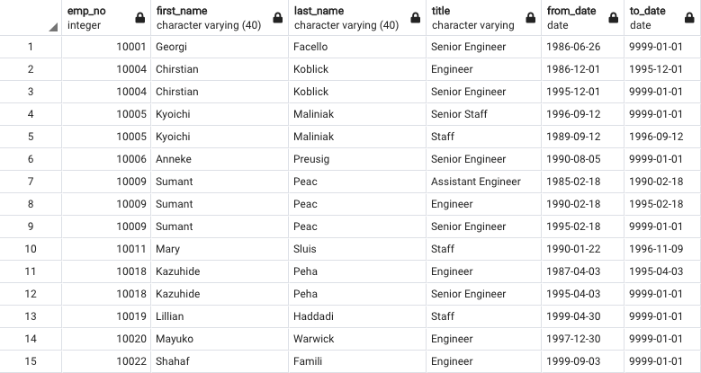
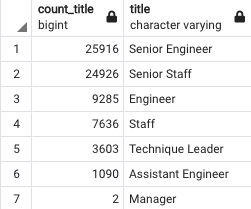

# Pewlett-Hackard-Analysis

## OVERVIEW OF ANALYSIS 

### The "silver tsunami" is a struggle that Pewlett Hackard is facing due to many of their employees approaching retiring ages. We created a number of tables utilizing the employee information in order to see what workers were eligible for retirement and were approaching that age. So that the company can better prepare for this "tsunami", we also added a table for current employees that can potentially mentor the upcoming new employees that will take over the other's jobs. 

## RESULTS

- Below i will explain four major points from the two analysis deliverables.

### Result 1:

- Above is a table we created in order to see who is in retiring age, this would've worked in a perfect world but in a realistic world people change jobs, switch careers, die, and this table inludes all of these people. We did the following to fix the issues found with this table
### Result 2:

- The second table we created for the challenge was to weed out all the multiple job titles that someone may have had. For example if you look at the first table I showed, you'll see that Christian Koblick, Kyoichi Maliniak, and Sumant Peac are all there multiple times. THis is because over the years their job tittle has changed. In the unique_titlestable we made sure to get rid of all the duplicates and make sure that these employees as still with the company. 

### Result 3:

In order for the company to know what position will most likely need to be filled soon we have created a table that shows a count of how many employees are retiring in a particular position. 

### Result 4:

- In order to prepare the incoming employees, we created a table that shows who in the current roles are eligible to mentor. It is a great turn out in total there are almost 1,5050.

## Summary 

### How many roles will need to be filled as the "silver tsunami" begins to make an impact?

- On the table above under result 3, you will see the break down of the current employees who will possibly be retiring soon. There is a total of 72,458 employees that can be retiring soon. All these employees will most likely not be leaving at the same exact time, however in a matter of a short spand of time a lot of new people will be coming into the ompany which can be a nightmare for training. 

### Are there enough qualified, retirement-ready employees in the departments to mentor the next generation of Pewlett Hackard employees?

- Absolutely not, with only a little over 1,500 pontential mentors available and over 72,000 employees that will be coming in, they will need to rethink their proccess. I think they shouldnt only look at the mentors but also at what position the mentor works in. In addition to that newer employees may also be great mentors and would add to the potential mentor count. If we add maybe 10 years to the eligibility. 
